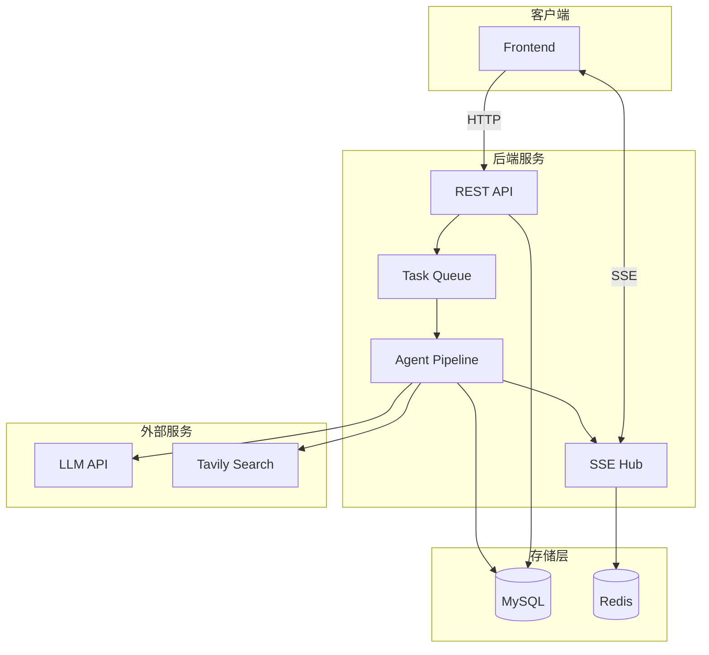
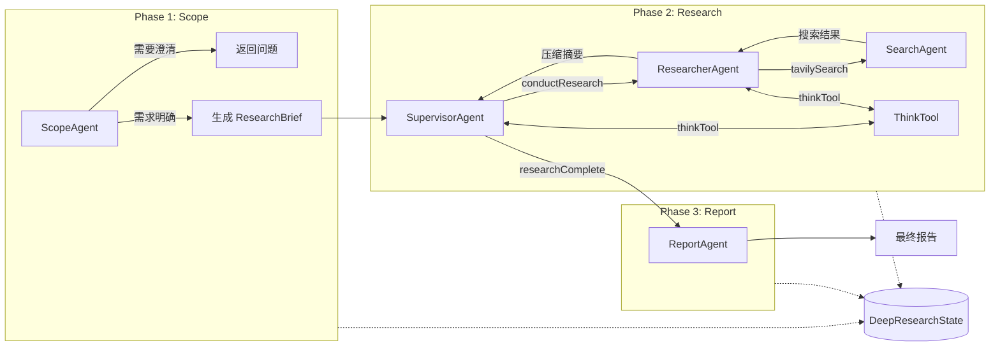
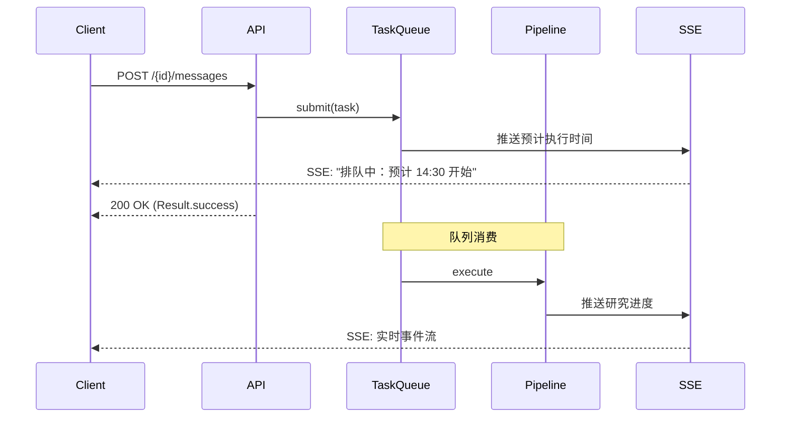
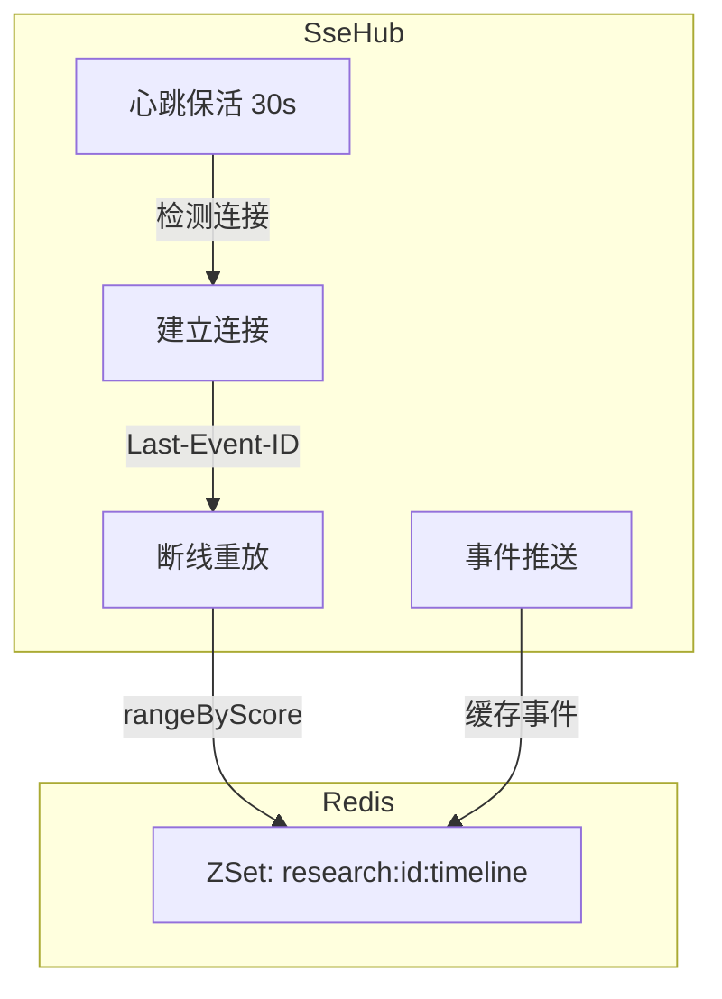

# Deep Research 深度研究

> 基于多智能体协作的自动化深度研究平台

**在线演示**：[research.chanler.dev](https://research.chanler.dev)

## 简介

Deep Research 整合 LLM 推理、Web 搜索与报告生成，实现从选题澄清、资料收集到成果撰写的全流程自动化。

## 核心架构

### 系统架构



### 智能体工作流

系统采用三阶段流水线，通过统一的 `DeepResearchState` 状态对象在各阶段间传递上下文：



**设计思路**：
- **ScopeAgent**：分析用户需求，判断是否需要进一步澄清。通过 LangChain4j 的 `ResponseFormat(JsonSchema)` 实现结构化输出，确保 LLM 返回可解析的 JSON
- **SupervisorAgent**：研究规划者，通过 `conductResearch` 工具调用 ResearcherAgent 执行子任务。使用 `ToolChoice.REQUIRED` 强制工具调用，避免无效文本输出
- **ResearcherAgent**：执行具体研究，调用 SearchAgent 进行 Web 搜索，并将搜索结果压缩为结构化摘要
- **ReportAgent**：基于所有研究笔记生成最终 Markdown 报告

## 技术亮点

### 1. 工具注册中心 (ToolRegistry)

**问题**：不同阶段的 Agent 需要不同的工具集，如何优雅地管理工具并支持运行时动态获取？

**方案**：基于自定义注解实现按阶段分组的工具注册：

```java
@SupervisorTool  // 标记 Supervisor 阶段可用
public class ConductResearchTool {
    @Tool(name = "conductResearch", description = "...")
    public String conductResearch(@P(value = "", required = true) String researchTopic) { }
}
```

启动时扫描所有带标记注解的 Bean，提取 `@Tool` 方法生成 `ToolSpecification`，按阶段分组存储。Agent 运行时通过阶段名获取对应工具规格：

```java
List<ToolSpecification> tools = toolRegistry.getToolSpecifications("SupervisorTool");
```

### 2. Budget 预算机制

**问题**：LLM Agent 容易陷入无限循环或过度搜索，如何控制研究深度和成本？

**方案**：设计三级预算配置，通过限制核心工具调用次数实现精细化控制：

```yaml
research:
  budget:
    levels:
      MEDIUM:
        max-conduct-count: 2    # Supervisor 最多调用 2 次 conductResearch
        max-search-count: 2     # 每个 Researcher 最多搜索 2 次
        max-concurrent-units: 1
      HIGH:
        max-conduct-count: 4
        max-search-count: 3
        max-concurrent-units: 2
      ULTRA:
        max-conduct-count: 6
        max-search-count: 4
        max-concurrent-units: 3
```

在工具执行前检查计数，达到限制时返回提示信息引导 Agent 完成任务：

```java
if (state.getConductCount() >= maxConductCount) {
    return "已达到研究任务配额限制，请调用 researchComplete 完成研究";
}
```

### 3. 异步任务队列 (@QueuedAsync)

**问题**：Spring 的 `@Async` 默认使用无界队列，高并发时可能导致 OOM；且无法感知任务排队情况。

**方案**：基于 AOP 实现自定义异步注解，支持有界排队和预计执行时间推送：



切面拦截 `@QueuedAsync` 方法，提取 `DeepResearchState` 参数并提交到有界线程池。提交时根据队列深度计算预计执行时间并通过 SSE 推送。

### 4. SSE 实时推送与断线重连

**问题**：研究过程耗时较长，如何实现可靠的实时进度推送？

**方案**：



- **事件缓存**：每个事件分配递增序列号，以 ZSet 存储到 Redis（score = 序列号），支持范围查询
- **断线重连**：客户端调用 `GET /research/sse`（携带 `X-Research-Id`、`X-Client-Id`，可选 `Last-Event-ID`）重连时，从 Redis 查询该序列号之后的所有事件并重放
- **心跳保活**：30 秒定时发送心跳，检测失效连接并清理

### 5. 幂等启动与状态机

**问题**：用户可能重复点击发送按钮，如何保证研究任务只启动一次？

**方案**：使用 CAS 更新实现幂等性：

```sql
UPDATE research_session 
SET status = 'QUEUE', update_time = NOW()
WHERE id = #{researchId} 
  AND user_id = #{userId}
  AND status IN ('NEW', 'NEED_CLARIFICATION')
```

只有状态为 `NEW` 或 `NEED_CLARIFICATION` 时才能启动，`affected = 0` 表示重复请求，直接拒绝。

### 6. Token 统计与持久化

全链路追踪每次 LLM 调用的 Token 消耗：

```java
TokenUsage usage = chatResponse.tokenUsage();
state.setTotalInputTokens(state.getTotalInputTokens() + usage.inputTokenCount());
state.setTotalOutputTokens(state.getTotalOutputTokens() + usage.outputTokenCount());
```

研究完成时持久化到数据库，支持用量分析和成本核算。

## 快速开始

### 方式一：Docker 部署（推荐）

```bash
# 拉取镜像
docker pull ghcr.io/chanlerdev/deep-research:latest

# 准备环境变量文件（参考下方"环境变量配置"）
cp .env.example .env && nano .env

# 启动容器
docker run -d -p 8080:8080 --env-file .env --name deep-research ghcr.io/chanlerdev/deep-research:latest
```

```bash
docker compose up -d
```

### 方式二：源码构建

**环境要求**：JDK 21+、MySQL 8.0+、Redis 6.0+

```bash
# 克隆项目
git clone https://github.com/chanlerdev/deep-research.git
cd deep-research

# 配置环境变量（参考下方"环境变量配置"）
cp .env.example .env && vim .env

# 初始化数据库
mysql -u root -p -e "CREATE DATABASE db_deep_research"
mysql -u root -p db_deep_research < src/main/resources/data.sql

# 启动服务
./mvnw spring-boot:run
```

后端 API 启动于 `http://localhost:8080`

### 环境变量配置

编辑 `.env` 文件，配置以下参数：

```properties
# 数据库连接
DB_URL=jdbc:mysql://127.0.0.1:3306/db_deep_research?useUnicode=true&characterEncoding=utf8&serverTimezone=Asia/Shanghai
DB_USERNAME=your_username
DB_PASSWORD=your_password

# Redis
REDIS_HOST=127.0.0.1
REDIS_PORT=6379
REDIS_PASSWORD=

# Tavily 搜索 API（https://tavily.com 获取）
TAVILY_API_KEY=tvly-xxxxx
TAVILY_BASE_URL=https://api.tavily.com

# JWT 签名密钥（至少 32 字符）
JWT_SECRET=your-secret-key-at-least-32-characters

# Google OAuth（如需 Google 登录）
GOOGLE_CLIENT_ID=xxxxx.apps.googleusercontent.com
GOOGLE_CLIENT_SECRET=xxxxx
GOOGLE_REDIRECT_URI=http://localhost:8080/oauth2callback

# 时区
APP_TIME_ZONE=Asia/Shanghai

# LLM 调用
LLM_TIMEOUT=120
LLM_LOG_REQUESTS=false
LLM_LOG_RESPONSES=false
```

### 前端部署

```bash
cd frontend
npm install && npm run dev
```

访问 `http://localhost:5173`

## 项目结构

```
src/main/java/dev/chanler/researcher/
├── application/              # 应用层
│   ├── agent/                # 智能体实现
│   │   ├── ScopeAgent        # 范围确定
│   │   ├── SupervisorAgent   # 研究规划
│   │   ├── ResearcherAgent   # 研究执行
│   │   ├── SearchAgent       # Web 搜索
│   │   └── ReportAgent       # 报告生成
│   ├── tool/                 # 工具系统
│   │   ├── ToolRegistry      # 工具注册中心
│   │   └── annotation/       # @SupervisorTool, @ResearcherTool
│   ├── state/                # DeepResearchState 状态对象
│   └── workflow/             # AgentPipeline 流水线
├── domain/                   # 领域层
│   ├── entity/               # 实体 (User, ResearchSession, ChatMessage...)
│   └── mapper/               # MyBatis Mapper
├── infra/                    # 基础设施层
│   ├── async/                # @QueuedAsync 异步任务
│   ├── sse/                  # SseHub 实时推送
│   ├── client/               # TavilyClient 外部调用
│   └── config/               # BudgetProps, AsyncProp 配置
└── interfaces/               # 接口层
    ├── controller/           # REST API
    └── service/              # 业务服务
```
